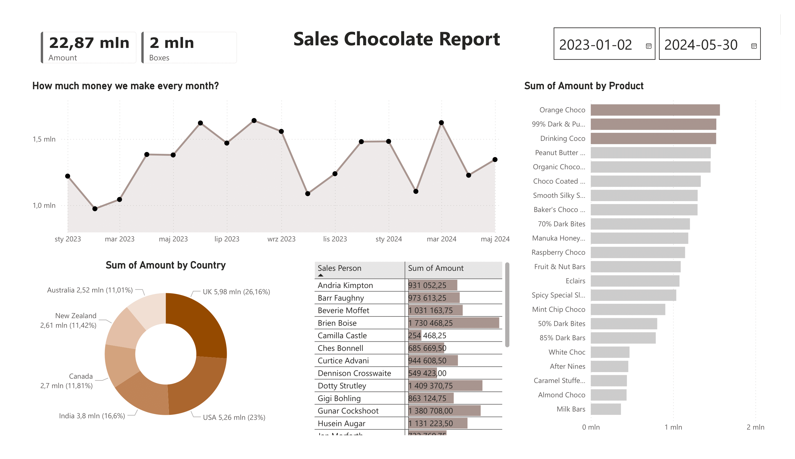

# Chocolate Sales Report
This project presents an interactive Power BI dashboard based on a chocolate sales dataset.
The goal of the dashboard is to explore sales performance across different countries, analyze product quantities, and identify key trends in the dataset.
## Table of Contents
- [Project Overview](#Project-Overview)
  - [How to Use](#How-to-use)
  - [Data](#Data)
  - [Visualization](#Visualization)
- [My process](#My-process)
  - [Built with](#Built-with)
  - [What I learned](#What-I-learned)
 - [Author](#Author)
## Project Overview
The purpose of this project is to analyze product sales and present the results in the form of a report and visualizations created in Power BI. The dashboard allows for interactive data exploration and helps identify sales patterns and trends.
### How to Use
1.  Download the `.pbix` file from this repository
2.  Open it in **Power BI Desktop**
### Data
You can download the datasets directly from my GitHub repository:
- [`chocolate-sales-database.xlsx`](https://github.com/Emmettek/chocolate_sales_dashboard/blob/main/database/chocolate-sales-database.xlsx)

### Visualization

## My process
### Built with
- Power BI
### What I learned
-   How to build an interactive dashboard in Power BI. 
-   How to clean, transform, and model data using Power Query. 
-   How to design a clear visual layout using consistent colors and typography.
-   How to create custom measures with DAX.  
-   How to use filters, slicers, and dynamic visuals to improve usability.
## Author
- LinkedIn - [@gryczkaleksandra01](https://www.linkedin.com/in/gryczkaleksandra01/)
